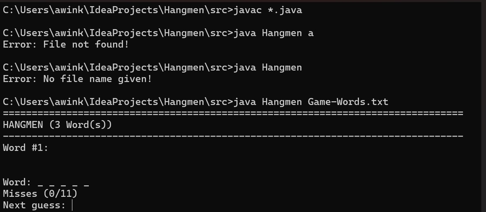

# Hangman
***
Hangman implemented in Java!

+ Hangman is a classic word-guessing game in which the player guesses a hidden word by suggesting letters. 
The guessing player has a limited number of attempts, which is represented by the drawing of a hanging stick-man.
The game continues until the guessing player guesses the word correctly or has no more attempts left 
(the figure is drawn in full)


## Installation
***

#### Requirements

- Windows-System
- JavaJDK in your CMD-Environment (see next phrase for installation instructions)

To run this program, it only needs to be executed in the command line. Make sure that [javaJDK](https://www.oracle.com/java/technologies/downloads/)
is already installed on your PC and set to your command-line-environment.


## How to play
***
If JavaJDK is set to your command-line-environment, change to your Folder (cd [Folder-Name]) where Hangman.java
is located and use following commands:

```bash
javac *.java
java Hangman [Words.txt]
```
The word in brackets indicates the location of your file, in which your game words are saved.
The program will show you some exceptions if the file name is incorrect, the file
could not be found or the file is not readable/empty.

#### Example:


- Word marks the word you are looking for characterized by underlines
- Misses marks the wrongly guessed words (cannot be guessed again)
- Next guess: The next letter that must be guessed by the player. Letters are only allowed from ```A-Z``` / ```a-z```, 
i.e. no special characters or umlauts


## Contact
***
- Author: Alexander Winkler

#### If you have any further questions or found some bugs, please don't hesitate to contact me!

- Email: [alexander.winkler@edu.fh-joanneum.at](mailto:alexander.winkler@edu.fh-joanneum.at)
- Telegram: [t.me/AlexWinkler](t.me/AlexWinkler)
- GitHub: [github.com/AlexWinkla](https://github.com/AlexWinkla)
- current University: [FH Joanneum](https://www.fh-joanneum.at)


#### If you want to see more of my works :)


> #### Markdown-Cheatsheet:
> This file shows the Syntax of a Markdown sheet and how to use it.
> * [Exercise1](./exercise1.md)


> #### GitHub-Cheatsheet:
> This file shows how to use Git-Hub, and what commands are used for git
> * [Exercise2](exercise2.md)
 
> #### First executing Java-File with maven
> Useful tool for automation and standardization
> * [Exercise3](exercise3.md)