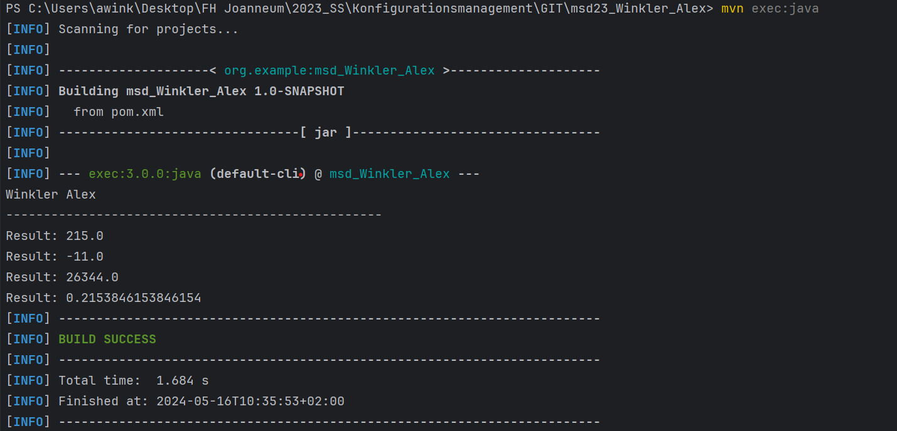

# Exercise 3
### Maven - Java Versioning

---

> ### First step was to create two java files, which do simple stuff (calculations, only used, that some output is generated)
>
> ###### After the first successful execution, a new "target" folder was created:
>
>

---
> ### Build file with maven
> ```bash 
> mvn compile
> ```
>
> 


---
> ### Execute file with maven
> ```bash 
> mvn java:exec
> ```
> ###### After execution, the output of the specified main class is output
>
> 

