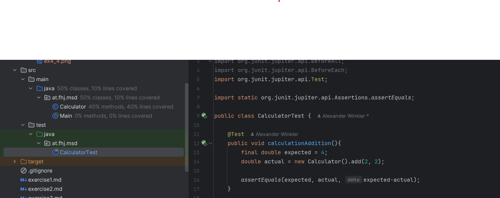
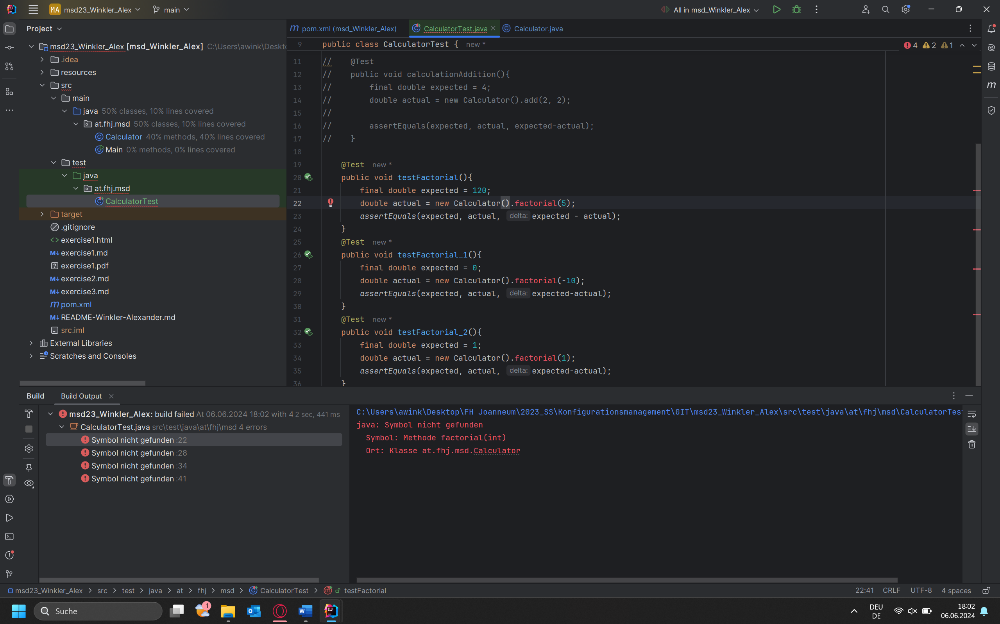
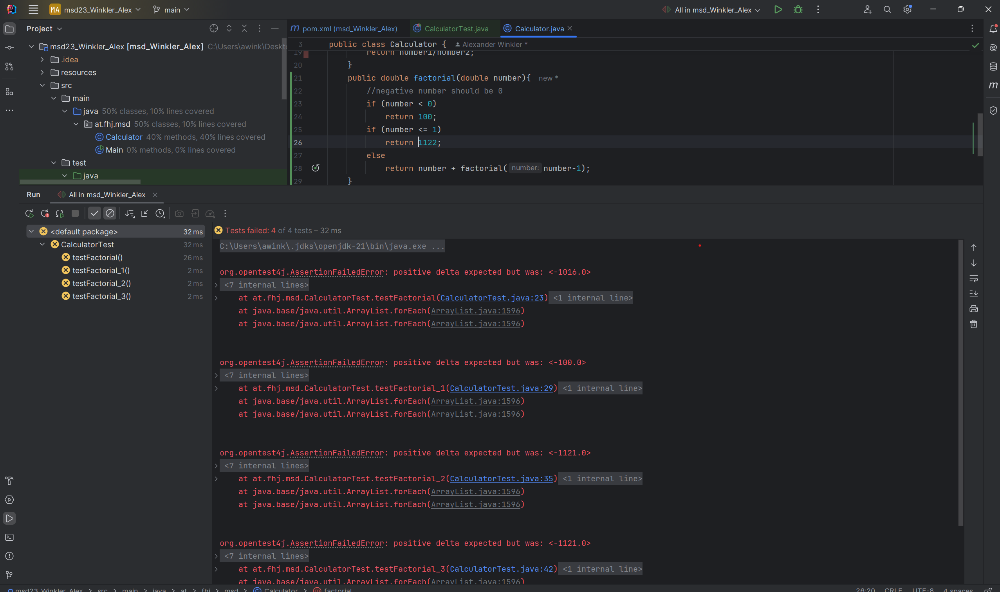
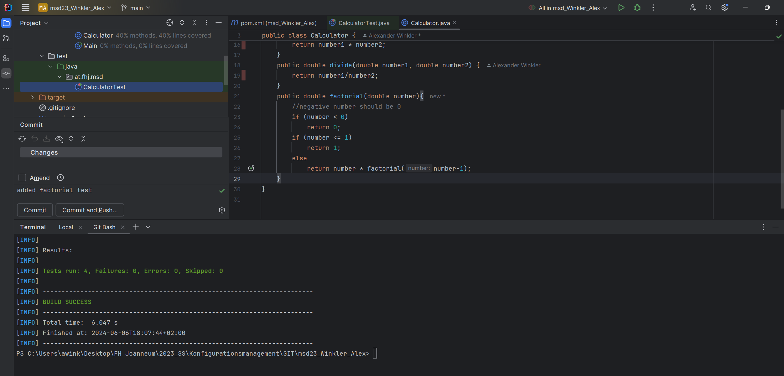

# first JUnit tests

### Creating "test/java File with Test class, use @Test annotation"
>

### Test-Classes for factorial function and how it look when test file fails (not created yet)
>

### Test-Classes for factorial function and how it looks like when the test fails (wrong output to expected)
>

### Build mvn file:  ``mvn test``, after this (all working) output should look like:

>
> 
> 