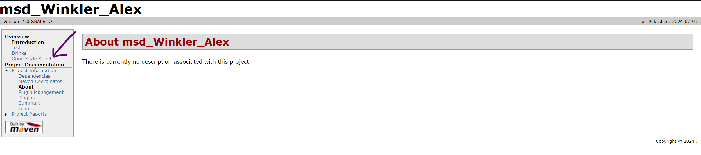
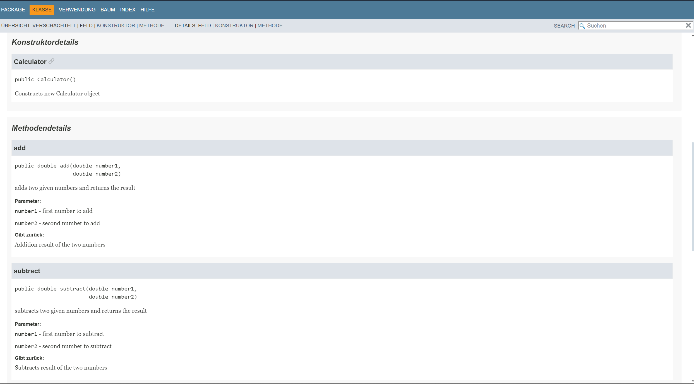
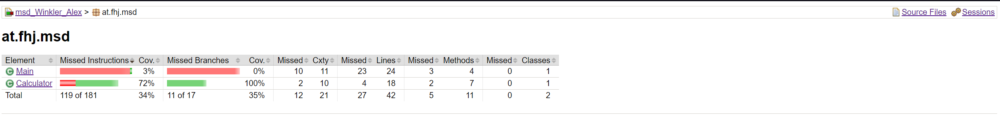

# Maven documentation

## Necessities:

- **Maven installation:** Maven must be installed on the system.
  This includes downloading and setting up the Apache Maven software.

- **Project structure:** A Maven project must have a valid project structure
  typically with a `pom.xml` (Project Object Model).

- **maven-site-plugin:** The maven-site-plugin must be configured in the
  `pom.xml` of the project. This plugin is responsible for
  the generation of the project website.

- **Configuration files:** Files such as `site.xml` and `pom.xml` contain
  the necessary configurations and information for generating
  the site.

- **Content resources:** Additional resources such as Markdown files,
  HTML files or reports that are to be integrated into the site.

- **Executing the plugin:** The site generation is started by
  executing the Maven command `mvn site`. This command
  collects the required information and generates the site in the
  `target/site` directory.

## Differences `site.xml` & `pom.xml`

### 1.`site.xml`

>- **Menu structure:** Definition of the navigation bars and 
>    menus of the site.
>- **Page structure:** Structure and hierarchy of the pages 
>    displayed on the website.
>- **Look and Feel:** Customization of the appearance of the site,
>    e.g. through CSS or theme settings.
>- **Documentation:** Integration and linking of various 
>    documentation pages and reports.

### 2.`pom.xml`

>- **Project information:** Basic information such as groupId, artifactId,
>   version, name, description.
>- **Build configuration:** Plugins and their configurations,
>   including the maven-site-plugin. 
>- **Dependencies:** Libraries and other dependencies that the 
>    project requires. 
>- **Repositories:** Configuration of repositories from which 
>    dependencies are obtained. 
>- **Profiles:** Different build profiles for different 
>    environments or use cases. 
>- **Reporting:** Configuration of reporting plugins that generate 
>    reports that can be integrated into the site.
>- **Distribution Management:** Settings for the distribution of the
>    project, such as upload targets for artifacts.

### 3.Summary

Roughly speaking, `site.xml` is mainly responsible 
for the structure and `pom.xml` is responsible for the basic 
project information and the plugin configurations.

---

> 
> 
> 
> 
> 
